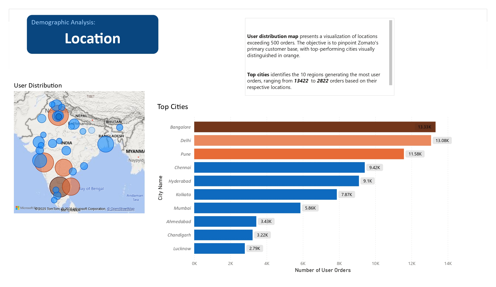
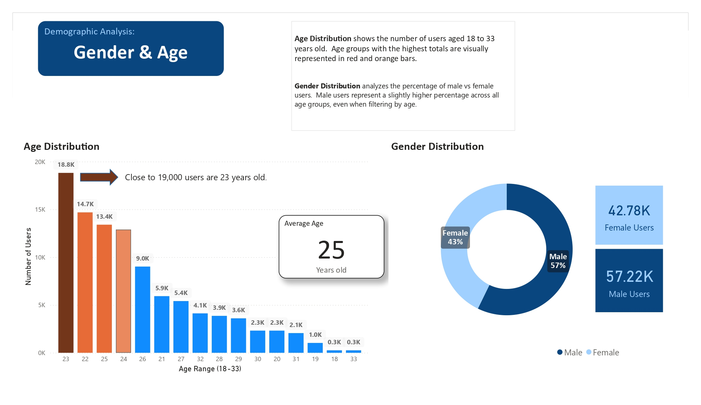
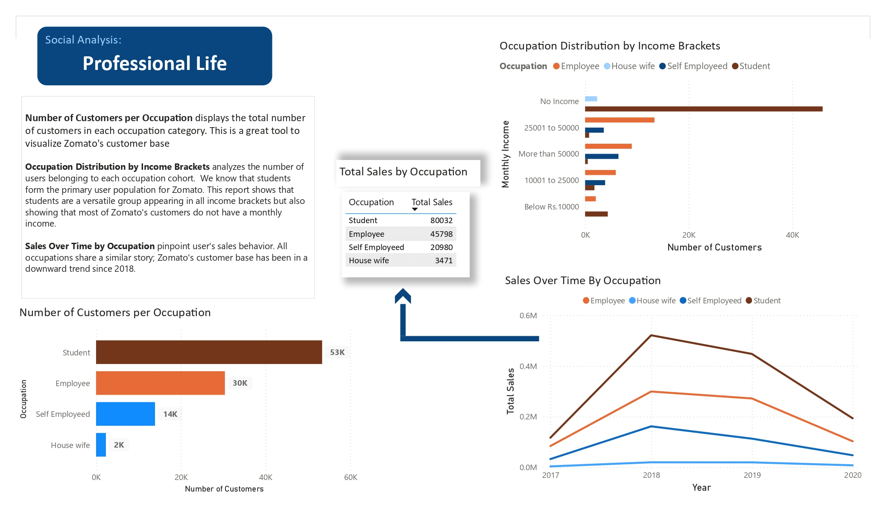

## Portfolio

---

### Power BI- Zomato Customer Analysis

[Location](/images/Final_Project_Dashbaord_page-0001.jpg)

---
[Gender](/images/Final_Project_Dashbaord_page-0002.jpg)

---
[Professional Life](images/Final_Project_Dashbaord_page-0003.jpg)

---

### Data Analysis Projects 

- [Power BI- Customer Analysis](https://github.com/jordisolis19/jordisolis19.github.io/blob/5b2f222f60b3a7ed32f520005e79ed1905cb8fc7/Final%20Project%20Presentation%20Github.pdf)
- [Tableau-Super Store Analysis](https://public.tableau.com/app/profile/jordi.solis/viz/SuperStoreReturnRateAnalysis_17397738034500/Presentation)
- [Tableau- Sales and Profit Analysis](https://public.tableau.com/app/profile/jordi.solis/viz/ProjectSprint4_17358615084820/ProfitandLossesSummary2)
- [Planning- Decomposition Brief and ERD](https://github.com/jordisolis19/jordisolis19.github.io/blob/4eca092b10c60c96cc8abbe51ff3a19e7353e6ca/Decomposition.pdf)
- [SQL- Music Store Analysis](https://github.com/jordisolis19/SQLTree/blob/7a1457145c0549f8eca3fc5e0b2827630770e717/Music%20Store%20Database-%20Final%20Project-)

---

---

Page template forked from <a href="https://github.com/evanca/quick-portfolio">evanca</a>

<!-- Remove above link if you don't want to attibute -->
